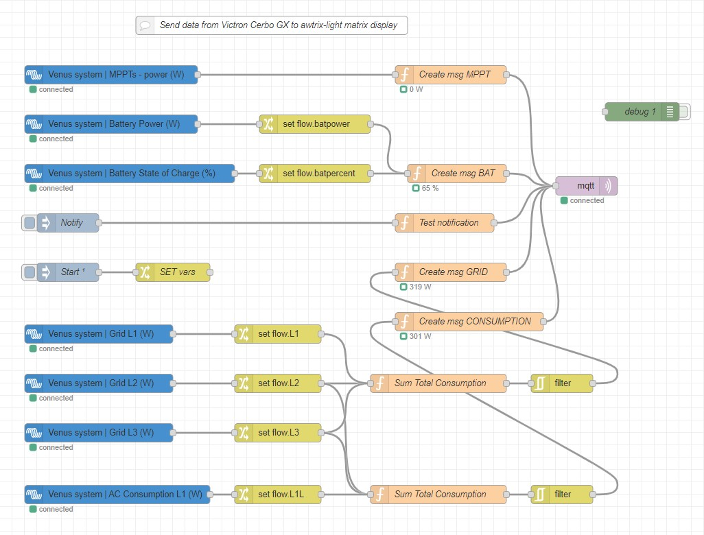
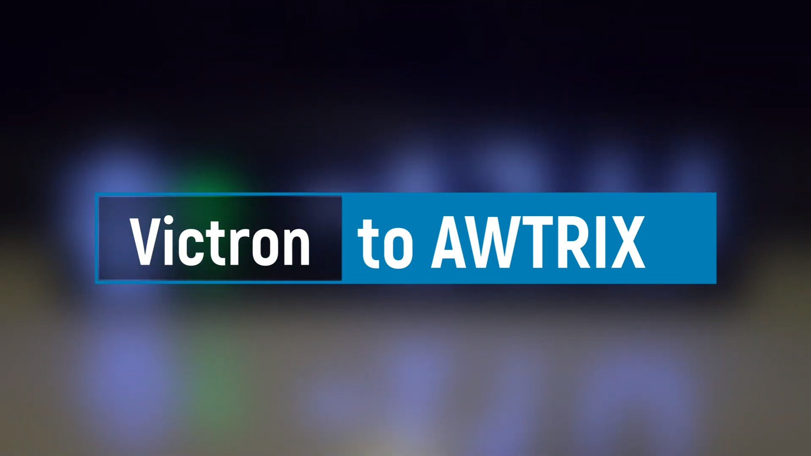

# Victron GX to Awtrix display
Node-RED flow for [Victron GX](https://www.victronenergy.com/live/venus-os:large) device and [AWTRIX](https://github.com/Blueforcer/awtrix-light)  LED Matrix Display

## Installation
1. Enable **MQTT broker** on Victron GX: _Go to **Settings** -> **Services** -> **MQTT** on the menus of the GX device_
1. Enable **Node-RED** on Victron GX: https://www.victronenergy.com/live/venus-os:large
1. Go to Node-RED web ui at address https://\<victron-gx-ip\>:1881 and import <a href="./flow.json" target="_blank">flow.json</a>
1. Set variables in **SET vars** node
1. Update MQTT broker connection in **mqtt** node (if needed)
1. Download following icons used in this flow into Awtrix display via **Icons** tab:
    - 49139
    - 6363
    - 54465
    - 55567
    - 6362
    - 6361
    - 6360
    - 6359
    - 33655
    - 54367
    - 53743
    - 44432

    ... or just download <a href="./icons.zip" target="_blank">icons.zip</a> from this project and upload uncompressed icons to Awtrix display via **Files** tab to **ICONS** folder.

## Video

## AWTRIX Flows

Link: <a href="https://flows.blueforcer.de/flow/rM3xoBrvo8Lz" target="_blank">https://flows.blueforcer.de/flow/rM3xoBrvo8Lz</a>
